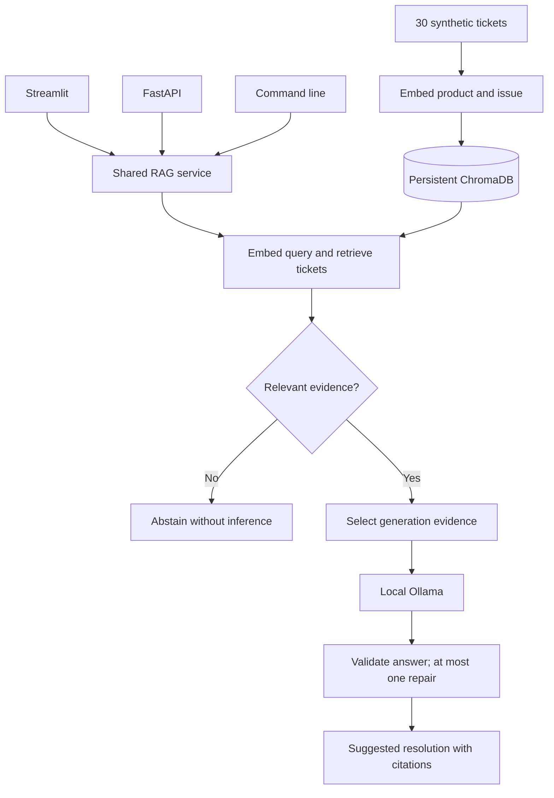

# Support Ticket RAG Assistant

A local assistant that retrieves similar historical support tickets and generates an evidence-grounded suggested resolution. Built with Python, LlamaIndex, ChromaDB, and Ollama, with Streamlit and FastAPI entry points sharing the same RAG logic.

The corpus contains **30 synthetic support tickets**. This portfolio project demonstrates retrieval evaluation, grounded generation, API reliability, and local Docker operation. No paid inference service or API key is required. Initial dependency and model downloads require internet access.

## Features

- Semantic retrieval with `BAAI/bge-small-en-v1.5` and persistent ChromaDB storage.
- Ticket citations, a relevance gate that can abstain without inference, and a narrow answer-consistency check with one repair attempt.
- A Streamlit interface and validated FastAPI service using shared retrieval and generation functions.
- Validated configuration, separate liveness/readiness checks, restrictive CORS, safe errors, and request IDs with logs that omit support-issue text.
- A non-root Linux container with persistent index and embedding-cache volumes, connected to host Ollama.
- 40 automated tests, a labeled retrieval evaluation, and separate live inference smoke checks.

## Architecture



Ticket product and issue text are embedded; resolutions remain metadata for generation. This matches customer symptoms to historical symptoms without embedding internal remediation language.

Retrieval returns three tickets by default. When one has a sufficiently strong score and lead, only that ticket is supplied to the model. The API and UI still return the complete retrieved evidence for inspection. Otherwise, generation can use multiple tickets.

Chroma is embedded in the application process. Docker packages the API and Python dependencies; Ollama stays on the host to reuse model downloads and hardware support. Streamlit runs separately and calls the shared Python service directly.

## Quick start: Windows / PowerShell

Python 3.12 is the validated runtime. Install Ollama and keep it running, then run these commands from the repository directory:

```powershell
python -m venv .venv
.\.venv\Scripts\python.exe -m pip install -r requirements.txt
ollama pull llama3.2:3b
.\.venv\Scripts\python.exe ingest.py
.\.venv\Scripts\python.exe -m streamlit run app.py
```

First ingestion downloads the embedding model. Dependencies and model files require local disk space; inference speed depends on hardware. Ingestion leaves an existing nonempty index intact. To intentionally replace it after editing the CSV, run `ingest.py --reset`.

Defaults work without an environment file. For overrides, copy `.env.example` to `.env` and see [configuration and troubleshooting](OPERATIONS.md). Restart processes after changing settings.

For a command-line answer:

```powershell
.\.venv\Scripts\python.exe rag.py "Customer cannot log in after resetting their password"
```

## Example behavior

For **“Customer cannot log in after resetting their password”**, the validated local smoke test produced:

```text
Likely Cause
The likely cause of the issue is a stale password-reset session.

Suggested Resolution
Clear the stale password-reset session and ask the user to sign in with the new password.

Relevant Historical Ticket IDs
SR001

Evidence Limitations
No material limitation in the retrieved evidence.
```

The API returned `SR001`, `SR002`, and `SR004` as retrieved evidence while the answer cited only `SR001`. Wording can vary with the model and runtime.

For **“How do I change my organization's logo?”**, the relevance gate returned an insufficient-evidence response without asking Ollama to generate a resolution.

## HTTP API

Start the API using the same environment and initialized index:

```powershell
.\.venv\Scripts\python.exe -m uvicorn api:app --host 127.0.0.1 --port 8000 --no-access-log
```

Open [interactive API documentation](http://127.0.0.1:8000/docs). Use a free port if the Docker API is already running.

| Endpoint | Purpose |
| --- | --- |
| `GET /health` | Liveness: the API responds independently of dependency readiness. |
| `GET /health/ready` | Checks the populated Chroma collection and configured Ollama model; returns 503 when unavailable. |
| `POST /v1/resolutions` | Returns a suggested resolution and retrieved evidence. |

```powershell
$body = @{ issue = "Customer cannot log in after resetting their password"; top_k = 3 } | ConvertTo-Json
Invoke-RestMethod http://127.0.0.1:8000/v1/resolutions -Method Post -ContentType "application/json" -Body $body
```

Responses contain `answer`, `evidence_sufficient`, and `evidence` records with ticket ID, product, issue, resolution, and similarity score. API callers cannot select a model; the server uses `OLLAMA_MODEL`, defaulting to `llama3.2:3b`.

Validation errors return safe 422 responses, unavailable services return 503, and unexpected errors return a generic 500. An `X-Request-ID` response header connects requests to structured operational logs. CORS allows no cross-origin browser access by default.

## Docker Desktop

With Docker Desktop using Linux containers and Ollama running on the Windows host:

```powershell
docker compose build
docker compose run --rm --no-deps api python ingest.py
docker compose up -d
docker compose ps
```

The API is published only on `127.0.0.1:8000`. Named volumes preserve the index and embedding cache across container replacement. Startup does not automatically ingest tickets or download an Ollama model. Native and container indexes are separate.

See [DOCKER.md](DOCKER.md) for container tests, evaluation, host connectivity, shutdown commands, and persistence details.

## Evaluation and verification

The version-controlled evaluation contains **13 cases: 11 supported and 2 unsupported**, tested against the 30-ticket synthetic corpus.

| Metric | Initial embedding: product + issue + resolution | Current embedding: product + issue |
| --- | ---: | ---: |
| Recall@3 | 100% (11/11) | 100% (11/11) |
| Mean reciprocal rank (MRR) | 0.939 | 0.955 |
| Data Sync MRR | 0.778 | 0.833 |
| Unsupported-query abstentions | 2/2 | 2/2 |

Recall@3 measures whether the expected ticket appears in the first three results; MRR rewards higher rankings. The symptom-focused experiment moved the expected ticket for case E006 from third to second place, not first. Current results were reproduced inside Linux Docker on September 13, 2026.

```powershell
.\.venv\Scripts\python.exe -m unittest discover -v
.\.venv\Scripts\python.exe evaluate.py
```

The 40 automated tests cover configuration, dependency failures, API contracts, CORS, safe errors, and grounding rules using mocks where appropriate. Retrieval evaluation uses the real embedding model and populated index. Separate live smoke checks confirmed direct-answer and unsupported-query behavior. Docker validation also confirmed persistence after container replacement.

## Tradeoffs and limitations

- The small synthetic evaluation is a development check, not evidence of real-world accuracy. Retrieval metrics do not measure every generated answer's correctness.
- The `0.50` relevance threshold and strongest-ticket policy are initial heuristics. Similarity scores are not probabilities of correctness.
- Answer validation checks narrow structural and citation rules. It cannot prove semantic grounding or prevent every hallucination; suggested resolutions require human review.
- Readiness checks model availability, not whether inference will succeed within available memory or latency limits.
- This is a local deployment with operational safeguards. Authentication, rate limiting, and TLS for public hosting are not implemented.
- Latency and concurrent-load behavior have not been benchmarked. Docker constraints improve repeatability but are not a complete transitive dependency lock.

## Code map

| Files | Responsibility |
| --- | --- |
| `ingest.py`, `search.py` | Index creation and shared retrieval |
| `rag.py` | Evidence selection, generation, and answer validation |
| `app.py`, `api.py` | Streamlit and HTTP entry points |
| `config.py`, `dependencies.py`, `errors.py` | Configuration, readiness, and safe service errors |
| `evaluate.py`, `data/evaluation_cases.json` | Labeled retrieval evaluation |
| `test_*.py` | Automated behavior and API tests |
| [OPERATIONS.md](OPERATIONS.md) | Settings, troubleshooting, and design decisions |
| [DOCKER.md](DOCKER.md) | Container architecture and validated local workflow |

## Future scope

These are potential extensions, not implemented features. The next priority is broader data and evaluation; additional complexity should be justified by measured results.

- **Larger, more diverse ticket dataset:** Grow beyond 30 synthetic tickets to cover more products, issue types, wording variations, and overlapping symptoms. Include ambiguous, incomplete, and unsupported requests. Explore appropriately licensed public data or authorized, de-identified support records, with checks for sensitive information and duplicates.
- **Stronger evaluation:** Build a separate held-out query set that is not used to tune retrieval thresholds or prompts. Keep near-duplicate examples out of tuning/test splits. Measure retrieval ranking and abstention errors alongside human-reviewed answer correctness, citation support, and completeness.
- **Retrieval improvements:** Compare metadata filtering, keyword-plus-semantic retrieval, and reranking against the current baseline on the expanded evaluation. Add them only if gains justify their latency and maintenance costs.
- **Response-time optimization:** Benchmark cold-start and warm-request latency, separating retrieval, generation, and repair time. Investigate reusing the embedding model and other expensive resources, then verify that quality does not regress.
- **Local model comparisons:** Evaluate alternative Ollama models for answer quality, latency, and memory requirements while retaining a free local development path.
- **Support workflow feedback:** Let reviewers flag unsupported suggestions and record whether a proposed resolution was useful. Use reviewed feedback to create new evaluation cases before changing the system.
- **Deployment safeguards:** Before public hosting, add authentication, authorization, rate limiting, TLS, and operational monitoring. If private tickets are introduced, enforce access restrictions during retrieval as well as at the API boundary.
